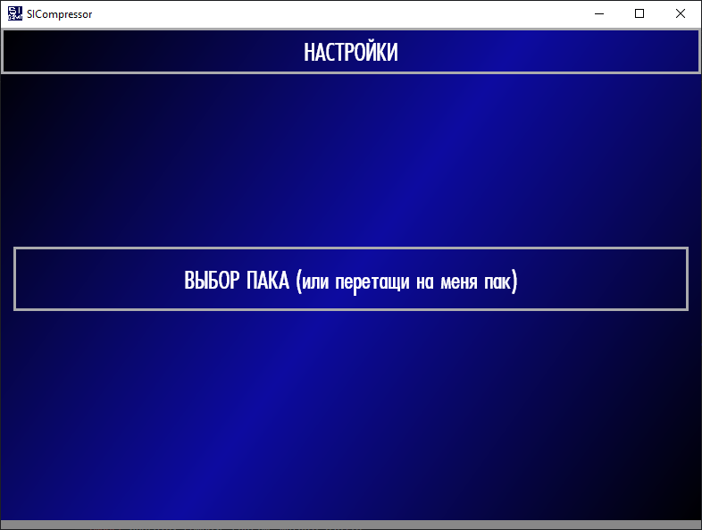

# SICompressor
Скачать можно тут -- [https://github.com/kokokochet/SICompressor/releases](https://github.com/kokokochet/SICompressor/releases)

Простое приложение для сжатия паков игры Владимира Хиля SIGame - https://vladimirkhil.com/si/game

Помогает с загрузкой медиа во время игры, к сожалению не все авторы паков достаточно внимательно подходят к добавлению изображений, музыки и видео. Часто у части игроков не загружаются картинки или загружаются с сильной задержкой. Зависимость со скоростью интернета игроков при этом не очевидная.

По опыту - зашакалить медиа помогает, но не в 100% случаев. Конкретных тестов не проводилось ¯\\_(ツ)_/¯

# Что делает
Приложение сжимает с потерями аудио, видео и изображения. Если файл уже достаточно маленький - не делает ничего. 
Так что несколько раз прогонять пак смысла нет.

### Для изображений 
Просто меняет разрешения картинки до заданного. Расширения файлов сохраняются.

### Для аудио
Переводит файл в моно и к заданному битрейту. Частоту дискретизации сохраняет.

### Для видео 
Меняет битрейт видео и аудио до заданного, с дорожкой звука действует так же как и с обычным аудио.
___
Я постарался сделать так, чтобы паки не ломались, __по идее__ в худшем случае файл просто не сожмется.
Но вы всегда можете проверить результат сами:
* Распаковать пакет и проверить файлы (должен справится любой архиватор)
* Открыть пакет в [SIQuester](https://vladimirkhil.com/si/siquester)
___
# Что не делает
Не меняет форматы файлов. В перспективе это изменится, потому что png, например, лучше заменить на jpg. 
(А ещё от gif хорошо бы избавится) А ещё оказывается что поддерживаемые форматы видео в десктоп клиенте и через сайт отличаются.

Так же в планах сделать возможность получать обновления через приложение.

# Настройки
В настройках есть возможность включить аппаратное ускорение на видеокарте: 
* h264_nvenc - для nvidia
* h264_amf - для AMD
* h264_qsv - для Intel
* libx264 - если не уверены, будет работать на процессоре

Сейчас в настройки добавил какое никакое описание пунктов. 
Если есть остаются вопросы или есть желание поиграть, пишите - [t.me/kokokochet](https://t.me/kokokochet)

# Спасибо Владимир Хиль 
Формат у паков достаточно простой и описан тут - 
[спецификация формата siq](https://github.com/VladimirKhil/SI/wiki/Спецификация-формата-.siq)

За это описание и отличную платформу онлайн игр спасибо Владимиру Хилю 
